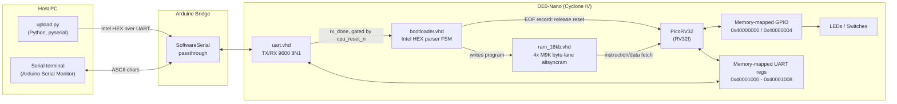
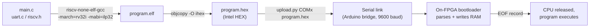

# DE0-RISC-V MCU

A complete RISC-V microcontroller built from scratch on a Terasic DE0-Nano FPGA, over a 12-week build plan — custom hardware, a UART bootloader, and a working C toolchain.

## Goal

By Week 12: write C code, compile it with a RISC-V GCC cross-compiler, upload it over UART with no JTAG required, and run it on custom RTL — CPU, memory, and peripherals all built from the ground up.

## Hardware

- Terasic DE0-Nano (Cyclone IV EP4CE22F17C6N)
- 50 MHz clock, 8 LEDs, 4 DIP switches, 2 buttons
- External: USB-UART bridge (Arduino, SoftwareSerial passthrough), 0.96" I2C OLED (planned)

## Stack

- **CPU:** PicoRV32 (RV32I — multiply/divide and compressed instructions disabled)
- **Languages:** VHDL (hardware), C (firmware), Python (host-side upload tooling)
- **Tools:** Quartus Prime Standard 22.1, ModelSim-Intel, xPack `riscv-none-elf-gcc` 15.2.0

## System Architecture

How a byte travels from the host PC to the CPU and back out to the LEDs, at runtime:

## Software Build Pipeline

How C source becomes a running program on the board:

## Progress

- [x] Week 1: LED blink at 1 Hz, clock divider, Quartus flow
- [x] Week 2: GPIO module, debounce, synchronizers
- [x] Week 3-4: Full-duplex UART TX/RX
- [x] Week 5: PicoRV32 + 16KB Block RAM + memory-mapped GPIO
- [x] Week 6: UART Intel HEX bootloader, RAM write, CPU reset release
- [x] Week 7: C toolchain (`riscv-none-elf-gcc` + Make), `blink.c` on hardware
- [x] Week 8: Memory-mapped UART C library (`printf`, RX FIFO, echo)
- [ ] Week 9-10: Timer, interrupts, SPI OLED
- [ ] Week 11-12: Integration + Dhrystone benchmark

## Weekly Summaries

- [Week 1](hw/week1_led_blink/README.md) — LED blink at 1 Hz, clock divider, Quartus flow
- [Week 2](hw/week2_gpio/README.md) — GPIO module, debounce, synchronizers
- [Week 3-4](hw/week3/README.md) — Full-duplex UART TX/RX
- [Week 5](hw/week5/README.md) — PicoRV32 + UART + RAM
- [Week 6](hw/week6/README.md) — PicoRV32 + UART bootloader
- [Week 7](hw/week7/README.md) — C toolchain + `blink.c`
- [Week 8](hw/week8/README.md) — UART C library
- [Week 9](hw/week9/README.md) — Timer + Interrupts