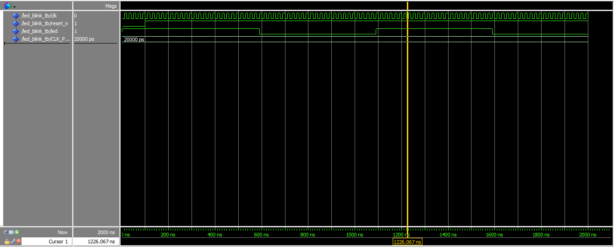

# Week 1: LED Blink

## Goal
Make LED0 blink at 1Hz using VHDL clock divider.

## Files
- `led_blink.vhd` - Clock divider + LED toggle
- `led_blink_tb.vhd` - ModelSim testbench
- `led_blink.qpf/qsf` - Quartus project and pin assignments

## Simulation

## Hardware Test
- LED0 blinks at 1Hz on DE0-Nano
- Photo: [link or embed]

## Key Learnings
- Clock enable vs gated clock
- DE0-Nano LEDs are active-low
- 50MHz / (2 * 1Hz) - 1 = 24,999,999 count for 1Hz