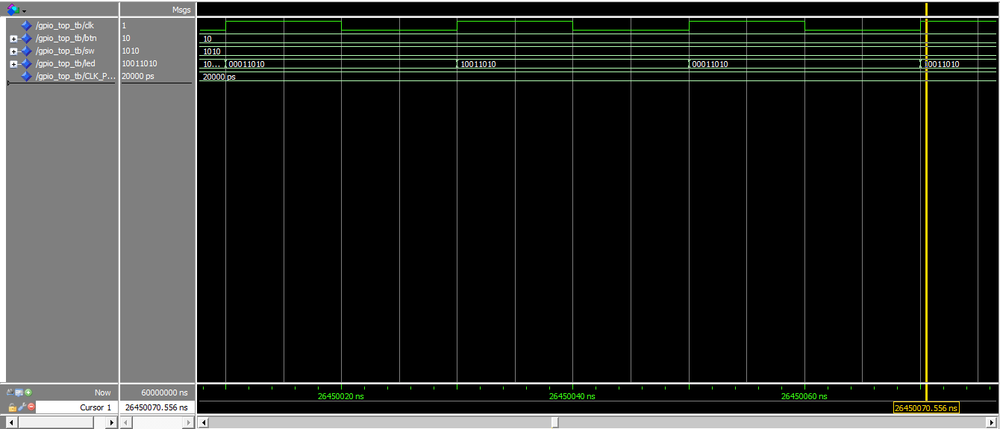
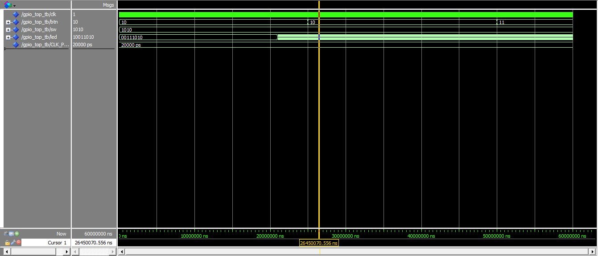

# Week 2: GPIO Module

## Goal
Build a GPIO peripheral with 8 LEDs, 4 DIP switches, and 2 pushbuttons. Implement button debounce and synchronizers.

## Hardware
- 8 LEDs (active low) on DE0-Nano
- 4 DIP switches (active low when ON)
- 2 pushbuttons (active low, with Schmitt trigger hardware)

## Files
- `gpio_top.vhd` - Top-level GPIO module with debounce and LED control
- `gpio_top_tb.vhd` - ModelSim testbench
- `week2.qpf/qsf` - Quartus project and pin assignments

## Features
- DIP switches SW[3:0] control LED[3:0] directly
- BTN0 toggles LED7, BTN1 toggles LED6
- LED5 and LED4 show raw button state
- 3-stage synchronizer on button inputs (metastability protection)
- 20ms debounce counter on each button

## Simulation

## Hardware Test
- ✅ DIP switches control LED[3:0]
- ✅ BTN0 toggles LED7 with debounce
- ✅ BTN1 toggles LED6 with debounce
- ✅ LED5/LED4 indicate button state

## Key Learnings
- Metastability: 3-stage synchronizer prevents undefined states from async inputs
- Debounce: 20ms counter eliminates mechanical switch bounce
- Active-low convention: DE0-Nano LEDs and buttons are active low
- All outputs registered: Prevents glitches on LED outputs