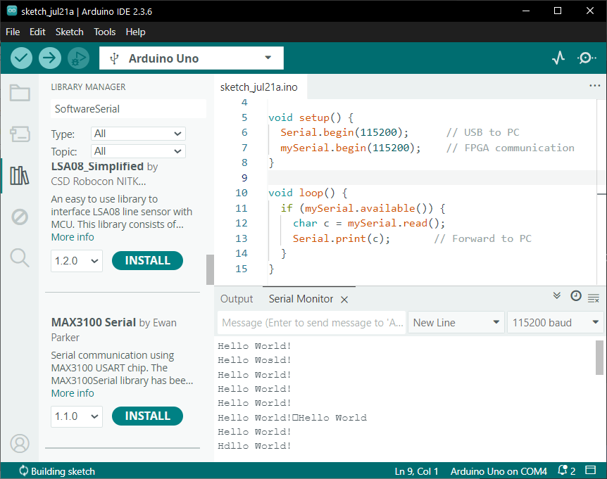
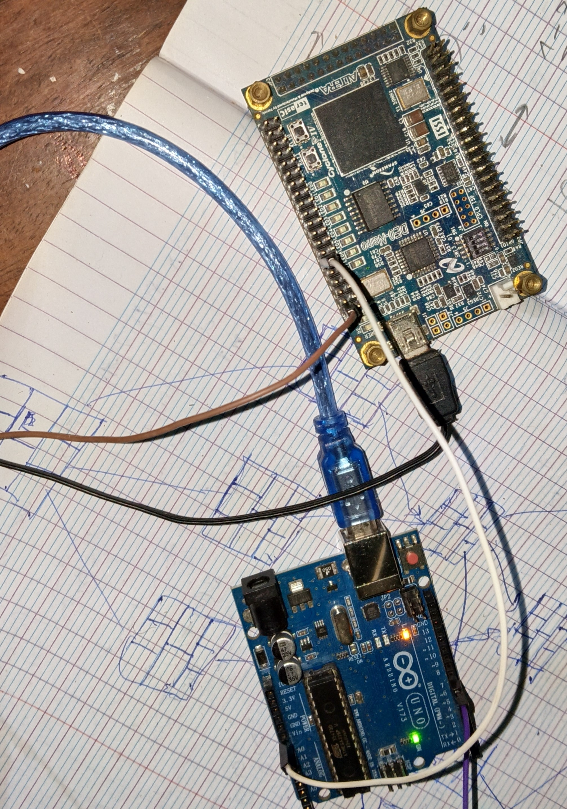
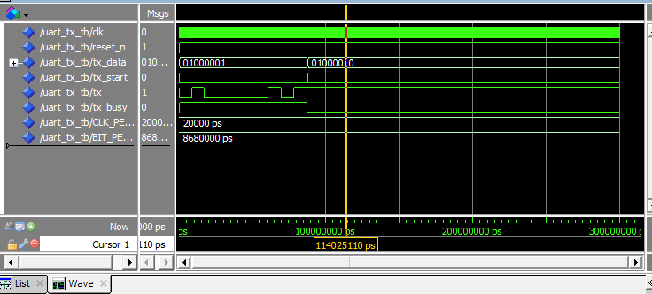
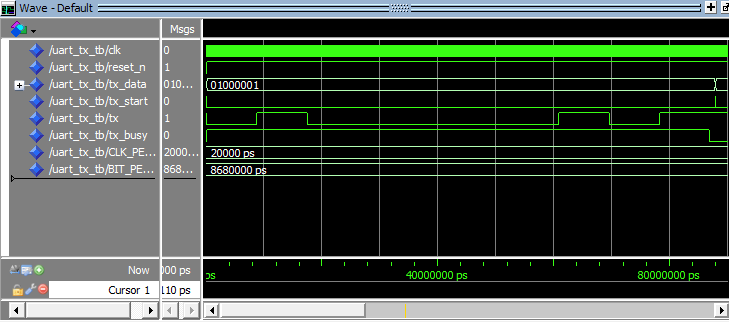

# Week 3: UART TX — "Hello World!" to PC Terminal

## Goal
Build a UART transmitter in VHDL that sends "Hello World!" from FPGA to a PC terminal via Arduino Uno as USB-to-UART bridge.

## Hardware Setup
- **FPGA:** DE0-Nano (Cyclone IV EP4CE22F17C6N)
- **Bridge:** Arduino Uno with SoftwareSerial
- **Wiring:**
  - DE0-Nano GPIO_0[0] (PIN_D3) → Arduino pin 8
  - DE0-Nano GND → Arduino GND
- **Arduino Sketch:** `arduino_bridge.ino` — receives on pin 8 via SoftwareSerial, forwards to PC via hardware Serial

## Baud Rate
- 115200 baud, 8 data bits, 1 stop bit, no parity (8N1)
- BIT_PERIOD = 50,000,000 / 115,200 = 434 clock cycles

## Files
- `uart_tx.vhd` — UART transmitter with single-register shifter architecture
- `hello_uart_top.vhd` — Top-level sequencer sending "Hello World!\r\n"
- `uart_tx_tb.vhd` — ModelSim testbench
- `week3.qpf/qsf` — Quartus project and pin assignments
- `arduino_bridge.ino` — Arduino SoftwareSerial bridge sketch

## Architecture: Single-Register Shifter
The transmitter loads the full 10-bit packet [STOP, D7..D0, START] into a shift register on `tx_start`. The LSB drives `tx` combinationally for instant start bit response. The register shifts right every bit period until all 10 bits are sent.

**Key design decisions:**
- `tx <= tx_reg(0)` — combinational assignment, no start bit delay
- `tx_busy` asserts immediately on `tx_start`, eliminating race conditions
- Simplified FSM: IDLE → LOAD → SHIFT (10 bits) → IDLE

## Top-Level Sequencer
Three-state FSM: `INTER_MSG_DELAY → SEND_CHAR → WAIT_UART_READY`
- Sends all 14 characters ("Hello World!\r\n") sequentially
- Waits for `tx_busy = '0'` before sending next character
- 1-second delay between complete messages

## Result

## Simulation

## Hardware Test
- ✅ Arduino SoftwareSerial bridge working (pin 8)
- ✅ "Hello World!" appears in Serial Monitor at 115200 baud
- ✅ Message repeats every ~1 second
- ✅ Debug LEDs confirm FSM state transitions

## Bugs Fixed
1. **Late start bit:** Original FSM delayed start bit by one baud period. Fixed with combinational `tx <= tx_reg(0)`.
2. **Missing last character:** Original sequencer cut off `\n`. Fixed by correcting `msg_idx` boundary check.
3. **Race condition:** Multi-state handshake (`WAIT_BUSY` → `GAP`) could miss `tx_busy` edge. Consolidated into single `WAIT_UART_READY` state.
4. **Baud rate mismatch:** SoftwareSerial unreliable at 115200 initially. Switched to hardware Serial (pin 0) with RESET-GND bridge, then validated SoftwareSerial on pin 8 also works.

## Key Learnings
- UART frame format: START(0) + 8 data bits (LSB first) + STOP(1)
- Clock enable vs derived clock for baud generation
- Combinational output assignment for instant timing response
- SoftwareSerial limitations on Arduino Uno
- Multi-state handshake simplification for reliable data transfer