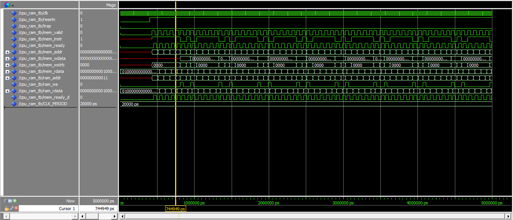
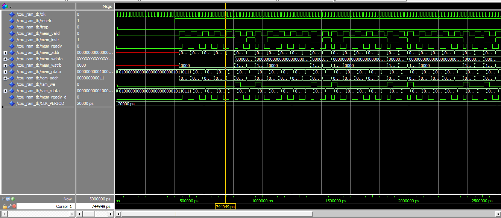
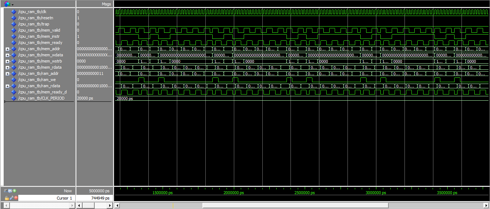

# Week 5: PicoRV32 CPU + 16KB Block RAM + GPIO

## Goal
Instantiate the PicoRV32 RISC-V CPU core, connect it to 16KB of Block RAM (M9K), and implement memory-mapped GPIO. Prove the CPU executes instructions from RAM by running a hardcoded blink program.

## Memory Map
| Address Range | Peripheral |
|---------------|------------|
| 0x00000000 - 0x00003FFF | 16KB Block RAM (4096 × 32-bit) |
| 0x40000000 | GPIO Output Register (write LEDs) |
| 0x40000004 | GPIO Input Register (read DIP switches) |

## Files
- `picorv32.v` — PicoRV32 RISC-V CPU core (Verilog, from YosysHQ)
- `soc_top.vhd` — System-on-Chip top level: CPU + RAM + GPIO + bus decoder
- `ram_16kb.vhd` — 16KB Block RAM using four altsyncram byte-lane primitives
- `cpu_ram_tb.vhd` — ModelSim testbench: CPU + RAM in isolation
- `ram_byte0.mif` through `ram_byte3.mif` — Memory initialization files (one per byte lane)
- `week5.qpf/qsf/sdc` — Quartus project, pin assignments, timing constraints

## PicoRV32 Configuration
| Parameter | Value | Reason |
|-----------|-------|--------|
| ENABLE_COUNTERS | 0 | Save logic, not needed yet |
| CATCH_MISALIGN | 0 | Save logic |
| CATCH_ILLINSN | 0 | Allow NOPs (0x00000000) without trap |
| ENABLE_IRQ | 0 | Not needed until Week 9-10 |
| BARREL_SHIFTER | 0 | Save logic |
| COMPRESSED_ISA | 0 | Standard 32-bit instructions only |
| STACKADDR | 0x00003FFC | Top of 16KB RAM |

## RAM Architecture
Four `altsyncram` primitives, each 4096×8-bit (one per byte lane). This guarantees M9K Block RAM usage and avoids Quartus inference bugs with byte-enabled wide memories.

**Why altsyncram instead of inferred RAM:**
Quartus 20.1 inconsistently infers byte-enabled Block RAM from VHDL arrays. Two byte lanes would map to M9K, two would expand to 110K+ logic cells. Explicit altsyncram instantiation forces all four lanes into M9K blocks deterministically.

## Bugs Fixed During Development

| Bug | Root Cause | Fix |
|-----|-----------|-----|
| 110K combinational nodes (design didn't fit) | Quartus expanded 2 of 4 byte lanes to logic cells instead of M9K | Replace inferred RAM with 4× altsyncram byte-lane primitives |
| CPU trapped immediately on power-up | No reset pulse after FPGA configuration; PicoRV32 started in bad state | Added power-on-reset counter: 16-cycle reset pulse after config |
| .mif file syntax errors | Quartus .mif format requires specific CONTENT/BEGIN/END structure without semicolons on BEGIN | Fixed .mif syntax with proper address ranges |
| LEDs appeared inverted | Assumed active-low LEDs (standard on many dev boards) but DE0-Nano LEDs are active-high | Changed `led <= not gpio_out_reg` to `led <= gpio_out_reg` |

## Simulation
- ✅ ModelSim: `cpu_ram_tb` — CPU fetches instructions, `mem_valid` pulses, `mem_addr` cycles 0→4→8→..., `trap` stays LOW

## Hardware Test
- ✅ Design fits: 1,415 logic cells, 96 RAM segments (M9K confirmed)
- ✅ All-zero .mif: CPU runs NOPs, no trap, LED(0) OFF
- ✅ Boot program .mif: CPU executes blink loop, LED(0) toggles at ~MHz (appears solid ON)
- ✅ Power-on-reset: CPU starts cleanly every power cycle
- ✅ BTN0 reset: Pressing button resets CPU

## Key Learnings
- PicoRV32 memory interface: `mem_rdata` must be valid when `mem_ready` fires
- `LATCHED_MEM_RDATA=0`: CPU latches data internally on `mem_valid && mem_ready`
- 1-cycle RAM read latency matches `mem_ready` delayed by one cycle from `mem_valid`
- Power-on-reset is critical: FPGAs need a clean reset edge after configuration
- altsyncram is a primitive, not an IP core — direct M9K instantiation
- Mixed-language simulation (VHDL + Verilog) works in ModelSim Starter Edition
- Quartus .mif format is strict: no semicolon after BEGIN, addresses in hex with leading zeros
