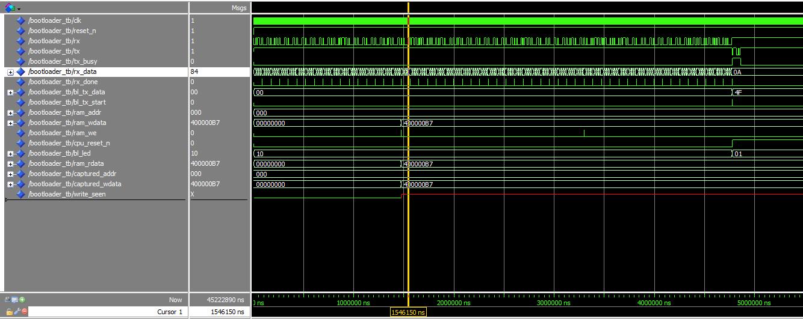

# Week 6: UART Bootloader

## Goal
Receive Intel HEX program over UART, write to Block RAM, release CPU from reset to execute it. Eliminates JTAG for code uploads.

## Architecture
- **UART RX** receives ASCII HEX characters at 9600 baud
- **Bootloader FSM** parses Intel HEX lines, assembles bytes into 32-bit words
- **Writes to Block RAM** (16KB) via byte-lane M9K blocks
- **EOF record** (`:00000001FF`) triggers CPU reset release
- **CPU (PicoRV32)** executes uploaded program from RAM

## Files
- `uart.vhd` — UART TX/RX 9600 8N1
- `bootloader.vhd` — Intel HEX parser + FSM
- `ram_16kb.vhd` — 4× M9K altsyncram byte lanes
- `soc_boot_top.vhd` — CPU + RAM + UART + Bootloader
- `picorv32.v` — RISC-V CPU core
- `ram_byte{0..3}.mif` — all zeros
- `upload.py` — Python upload script
- `arduino_bridge.ino` — Arduino SoftwareSerial bridge

## Testbench
`bootloader_tb.vhd`
## Simulation


## Intel HEX Format
:LLAAAATTDD...CC
- `LL` = byte count
- `AAAA` = 16-bit address
- `TT` = record type (00=data, 01=EOF)
- `DD` = data bytes (little-endian)
- `CC` = checksum

## Critical Findings

### 1. HEX byte order is little-endian
The bytes in a HEX data record go to memory in the order they appear, NOT reversed. To get instruction `0x400000B7`:
- Correct HEX: `:04000000B7000040XX` (bytes B7, 00, 00, 40)
- Wrong HEX: `:04000000400000B7XX` (would load `0xB7000040`)

### 2. Arduino resets when Python opens COM port
`pyserial.Serial()` toggles DTR which resets the Arduino. Add `time.sleep(2)` after opening the port.

### 3. All .mif files must be zero
The bootloader writes everything at runtime. Non-zero init values conflict.

### 4. .hex file encoding
UTF-8 without BOM, Windows CRLF line endings.

## Hardware Test
- ✅ UART receives ASCII HEX
- ✅ Bootloader parses, writes to RAM
- ✅ ACK 'O' sent after EOF
- ✅ CPU released from reset
- ✅ CPU executes uploaded program (LED[7] turned ON)
- ✅ Python upload script works

## Python Upload
```bash
python upload.py COM4 program.hex

## Wiring
|DE0-Nano	|Arduino    |
|---------------|-----------|
|PIN_D3 (FPGA TX)|	Pin 8|
|PIN_C3 (FPGA RX)|	Pin 9|
|GND	|GND    |

## Key Learnings
Intel HEX parsing in VHDL is nontrivial but doable

Byte ordering matters — always verify against known reference

Python pyserial + Arduino requires explicit reset delay

Simulation passes ≠ hardware works; timing and encoding differ