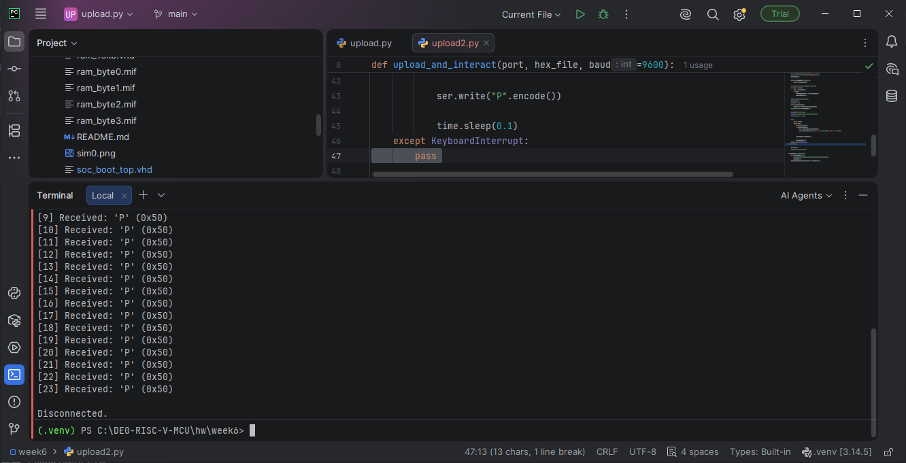

# Week 8: UART C Library

## Goal
Expose UART to C via memory-mapped registers. Write `uart_putc`, `uart_puts`, `uart_printf`, `uart_getc`, `uart_available`. Print from C to the PC terminal and receive typed characters.

## Architecture
```
C code (main.c)
│ uart_printf("...")
▼
uart.c library
│ writes bytes to memory-mapped register
▼
Memory-mapped UART registers (VHDL)
│
▼
uart.vhd (9600 8N1)
│
▼
DE0-Nano PIN_D3 → Arduino → PC
```

## Memory Map

| Address | Register | Access | Notes |
|---------|----------|--------|-------|
| 0x40000000 | GPIO output | R/W | LEDs (active high) |
| 0x40000004 | GPIO input | R | DIP switches |
| 0x40001000 | UART TX data | W | Write byte to transmit |
| 0x40001004 | UART TX status | R | Bit 0 = tx_busy |
| 0x40001008 | UART RX data | R | Bit 8 = valid, bits 7:0 = data |

## VHDL Implementation

### New address decodes
```vhdl
is_uart_tx        <= '1' when cpu_mem_addr = x"40001000" else '0';
is_uart_tx_status <= '1' when cpu_mem_addr = x"40001004" else '0';
is_uart_rx        <= '1' when cpu_mem_addr = x"40001008" else '0';
```
## sw/riscv-lib/uart.c

### Functions:

`uart_putc(c)` — polls TX status bit 0, then writes byte to `UART_TX_DATA`

`uart_puts(s)` — loops over chars

`uart_available()` — returns 1 if bit 8 of `UART_RX_DATA` is set

`uart_getc()` — blocks until valid, returns byte

`uart_printf(fmt, ...)` — supports `%d`, `%u`, `%x`, `%X`, `%c`, `%s`, `%%`

Uses `stdarg.h` (`va_list`, `va_start`, `va_arg`, `va_end`) for variadic arguments.

## Hardware Test Results
```
☑ Banner prints at boot via uart_puts and uart_printf
☑ %u, %x, %d, %c format correctly
☑ uart_getc() receives characters
☑ uart_available() correctly detects incoming bytes
☑ LED[7] toggles on each received character
☑ RX FIFO prevents byte loss when sender is fast
☑ GPIO read returns actual register value
```


## New files added
```
hw/week7/riscv-lib/uart.h

hw/week7/riscv-lib/uart.c

hw/week7/examples/hello_uart/hello.c

hw/week7/examples/hello_uart/Makefile
```