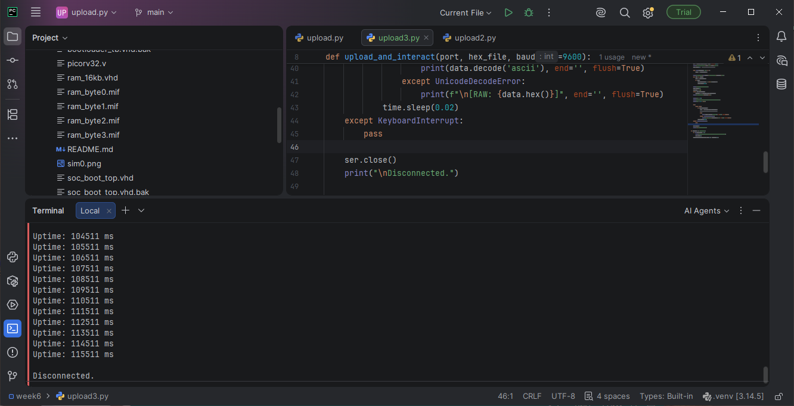
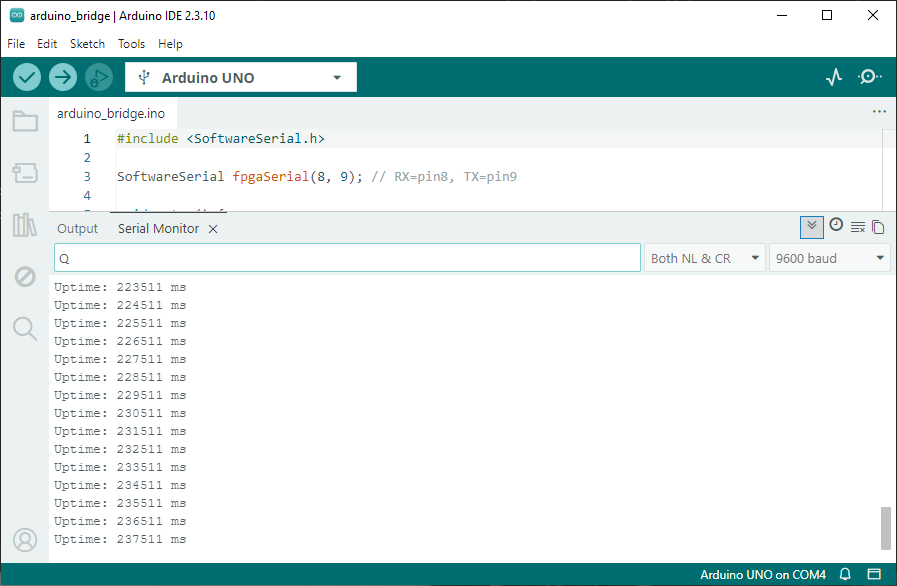

# Week 9: Timer + Interrupts

## Goal
Add a hardware timer peripheral with interrupt support. Enable PicoRV32 interrupts. Provide `millis()` for non-blocking delays in C.

## Architecture

```
┌──────────────────────────────────────┐
│            FPGA                       │
│  ┌──────────┐    ┌──────────────┐    │
│  │ PicoRV32 │◄───│ Timer Module │    │
│  │ CPU      │irq │              │    │
│  │          │    │ - counter    │    │
│  │          │    │ - compare    │    │
│  │          │    │ - pending    │    │
│  └──────────┘    └──────────────┘    │
│       │                               │
│       │ Memory-mapped                 │
│       ▼                               │
│  Timer registers at 0x40002000        │
└──────────────────────────────────────┘
```

The timer counts to `compare` cycles, sets a pending flag, and asserts `irq(0)` to PicoRV32. The core jumps to `PROGADDR_IRQ` (0x10), runs the handler, clears the pending flag, and returns via `retirq`.

## Memory Map (Week 9 additions)

| Region | Address | Access |
|--------|---------|--------|
| Timer control (enable=bit0, pending=bit1) | 0x40002000 | R/W |
| Timer compare | 0x40002004 | R/W |
| Timer count | 0x40002008 | R/W (write resets to 0) |

## PicoRV32 IRQ Interface

| Signal | Direction | Purpose |
|--------|-----------|---------|
| `irq` | Input (32 bits) | Interrupt request lines. Bit 0 = timer. |
| `eoi` | Output (32 bits) | End-of-interrupt info |
| `PROGADDR_IRQ` | Parameter | IRQ handler address (`0x00000010`) |
| `ENABLE_IRQ_QREGS` | Parameter | Enables q0-q3 registers for IRQ return address |

## Files

- `hw/week9/timer.vhd` — memory-mapped timer peripheral
- `hw/week9/soc_boot_top.vhd` — CPU + RAM + UART + bootloader + timer, IRQ wired
- `hw/week7/riscv-lib/start.S` — reset vector, IRQ handler, BSS clear
- `hw/week7/riscv-lib/link.ld` — places IRQ handler at exact address 0x10
- `hw/week7/riscv-lib/timer.h` / `timer.c` — `timer_init()`, `millis()`, `timer_delay_ms()`
- `hw/week7/riscv-lib/riscv.h` — `irq_enable()` / `irq_disable()` (raw `.insn` encoding)
- `hw/week7/examples/timer/timer_test.c` — prints uptime every second, toggles LED[7]

## Critical Findings

PicoRV32's custom instructions and non-standard interrupt model produced several bugs that don't show up until you actually try to build/run this — worth remembering for later weeks.

### 1. `retirq` / `maskirq` are not real assembler mnemonics
They're PicoRV32-specific custom-0 opcode encodings, not part of the RISC-V ISA. Standard binutils (including xPack's) doesn't recognize them as text. They must be emitted as raw machine code via GNU as's `.insn r` directive with the correct `funct7`/`funct3` fields:

| Instruction | funct7 | funct3 |
|---|---|---|
| `getq rd, qs` | 0x00 | 0x4 |
| `setq qd, rs` | 0x01 | 0x2 |
| `retirq` | 0x02 | 0x0 |
| `maskirq rd, rs` | 0x03 | 0x6 |

q-registers (q0-q3) use the same numeric field as `x0`-`x3` — write `x0`..`x3` as the operand.

### 2. IRQ handler must save ALL caller-saved registers, not just a few
An interrupt can land at any point in the foreground code, not just a function-call boundary — so every register a C function is free to clobber (`ra`, `t0`-`t6`, `a0`-`a7`) must be saved/restored around the call into the C handler. Saving only `ra`/`a0`-`a2` produces rare, hard-to-reproduce corruption depending on what the compiler happened to use inside the handler.

### 3. PicoRV32 has no `mstatus` CSR
It doesn't implement the standard M-mode CSR trap architecture at all — it uses `maskirq`/q-registers instead. A leftover `csrw mstatus, a0` from generic RISC-V boilerplate will trap immediately at boot once `CATCH_ILLINSN => 1` is set (which is otherwise a good idea — see below). Don't include this instruction anywhere in startup code for this core.

### 4. Linker script must place a tiny jump at 0x00, not the full startup routine
`. = 0x10;` in the linker script assumes whatever came before it is ≤16 bytes. The full `_start` routine (stack setup, BSS clear, call main) is much larger than that, so `. = 0x10` will try to move the location counter backward and fail to link. Fix: put a single 4-byte `j reset_handler` at address 0, and give `.text.irq` its own explicit absolute address (`0x00000010`) in the linker script rather than relying on arithmetic from a preceding section.

### 5. `CATCH_ILLINSN => 1` is worth enabling here specifically
With hand-encoded `.insn` instructions in play, a typo in the encoding is otherwise silent — the core would just execute whatever the bit pattern happens to decode to. Turning on illegal-instruction trapping means an encoding mistake shows up as an immediate, clean trap instead of unpredictable misbehavior.

### 6. `pending` had two drivers in early `timer.vhd`
The counter-wrap logic and the software-clear-on-write logic were originally two separate processes, both assigning the same `pending` signal — a genuine multiple-driver conflict that Quartus would flag. Fixed by merging into one process with the software clear given priority on a simultaneous cycle.

### 7. Same async-reset pattern as earlier weeks, fixed the same way
`timer.vhd`'s registers were on `process(clk, reset_n)` (async reset) — the same `DEV_CLRn` push-back risk that caused the Week 5 `gpio_out_reg` power-up bug. Converted to synchronous reset for consistency with the rest of the design.

## Hardware Test

- [x] Timer VHDL module compiles, single-process, synchronous reset
- [x] PicoRV32 IRQ enabled (`ENABLE_IRQ => 1`, `ENABLE_IRQ_QREGS => 1`)
- [x] IRQ handler confirmed at address 0x10 via `objdump -d`
- [x] `.insn` encodings verified against disassembly before flashing
- [x] `millis()` returns increasing values
- [x] `timer_test` prints uptime once per second over UART
- [x] LED[7] toggles every second, confirmed on hardware

## Results



## Comprehension Answers

1. **Why must the IRQ handler be at exactly `0x10`?** PicoRV32 doesn't use a vector table — on interrupt, the PC jumps directly to `PROGADDR_IRQ`. Whatever instruction physically sits there executes first.
2. **What does `retirq` do, and how does it differ from `mret`?** It restores the PC from the hardware-saved return address (held in `q0`, or `x3`/`gp` if q-registers are disabled) and re-enables interrupt handling. Unlike `mret`, it doesn't touch any standard CSR, since PicoRV32 has none of the usual `mstatus`/`mepc` machinery.
3. **Why save `ra, t0-t6, a0-a7` and not `s0-s11`?** Callee-saved registers (`s0`-`s11`) are already protected by normal C calling convention — any function that uses them (including the IRQ handler itself) is required to save/restore them in its own prologue/epilogue. Caller-saved registers have no such guarantee and can be freely clobbered by any function call, including one triggered involuntarily by an interrupt — so the handler must protect them explicitly.